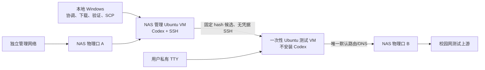

# IPGW-Meta v1 分阶段执行与远程验收计划

本文是 `IPGW-META-V1` 的权威执行计划。发布以门禁为准，不以日期为准；每个执行窗口最多 30–45 分钟，到点必须停止、验证并交接。

## 1. 总体目标、安全边界与职责

### 1.1 目标与实施顺序

将当前“能够实际登录”的初步版本收敛为：

- 协议正确、默认安全的单一 Go SDK。
- 稳定的现代 CLI、JSON 和退出码契约。
- legacy、meta、dispatcher 三入口兼容产品。
- 可恢复的配置迁移与离线安装。
- 测试字节与发布字节完全相同的不可变候选链。
- 可在 BHK 与双网口 NAS 上执行、不会记录凭据的真实校园网验收。
- 经过 SSH 签名 tag、GitHub provenance attestation 和逐资产哈希验证的 `v1.0.0`。

实施顺序为：先完成文档和紧急安全处理，再收敛协议与 SDK，随后完成三入口、配置迁移与离线安装，最后构建一次候选并完成真实网络验收和原样晋升。

### 1.2 已锁定决策

- 第一执行窗口只做只读冻结前检，不创建提交或修改 refs。
- 高风险动作分别确认：凭据、网络/会话、历史重写、强制推送、仓库改名、规则保护、正式发布、敏感备份删除。
- GitHub 仓库最终为 `UnbalancedCat/ipgw-meta`；新权威本地工作区为 `D:\project\Go\ipgw-meta-clean`。
- 旧 `D:\project\Go\IPGW-Meta` 在 clean clone 验证后隔离，不再用于开发。
- `v1.0.0` 使用专用 SSH 签名 annotated tag，并为候选和发布资产生成 GitHub artifact attestation。
- 历史清理和小写改名后严格保护 `main`：要求 PR、严格 CI、签名提交，阻止删除和 force-push，并约束 `v*` tag 更新/删除。
- 只有一个授权校园账号。真实环境不测试异账号 conflict/switch；它保持 `synthetic_covered + live_unverified`，不阻塞 v1。
- 泄露会话已由维护者于 2026-08-28 通过官方门户确认失效；只记录该事实，不保存截图、Cookie 或其他认证材料。
- 自更新继续禁用。
- 手机验证码保持 `observed_anonymous + detected_only`，不实现发送、提交或保存。
- Docker 只用于无凭据合成测试；真实认证必须使用 VM 或原生 Windows，不使用 Docker host network。

### 1.3 职责

维护者负责 GitHub、ZOS、物理线缆、网络切换和外部系统操作；在私有终端输入密码、扫描二维码；管理 SSH 签名私钥并创建最终签名 tag；对每项高风险动作逐项批准；审阅脱敏 evidence 后决定入库摘要。

执行 Agent 负责仓库审计、规范、代码、测试、候选构建和哈希验证；提供 ZOS/VM/远端任务清单；协调本地、NAS 和 BHK 短任务；只解析固定白名单结果，不接触密码、验证码、QR payload 或原始认证响应；每个窗口结束后停止并报告结果、阻塞和下一步。

外部 CI 可在窗口结束后继续运行，但本地只记录 workflow/run ID，不持续等待；下一窗口再读取结果。

## 2. 产品、SDK、CLI 与配置契约

### 2.1 产品结构

Go module 为 `github.com/UnbalancedCat/ipgw-meta`，根包名为 `ipgw`。三个入口固定为：

| 入口 | 行为 |
|---|---|
| `ipgw-legacy` | 保留 1.x 旧工作流和无参数登录；最早 2.0 移除 |
| `ipgw-meta` | 现代命令；无参数只显示只读状态或帮助 |
| `ipgw` | 纯模式分发器，不执行网络或凭据逻辑 |

模式优先级为 `--mode > IPGW_MODE > launcher 配置 > 安装批次默认`。旧安装升级后保持 legacy；从 `v1.0.0` 起全新安装默认 meta。三入口、launcher 元数据和安装器必须作为同一原子 bundle 更新。NEU/CAS/Srun/Dashboard 是内部边界；v1 不建设通用插件、daemon、GUI 或多语言 RPC。新 SDK 完全替代后移除 `neugo`。

### 2.2 Go SDK

公开 façade：

```go
func NewClient(opts ...Option) (*Client, error)

func WithBindIP(netip.Addr) Option
func WithRoundTripper(http.RoundTripper) Option
func WithObserver(Observer) Option
func WithProtocolStateStore(ProtocolStateStore) Option

func (c *Client) Status(context.Context) (Status, error)
func (c *Client) Login(context.Context, LoginRequest) (LoginResult, error)
func (c *Client) Logout(context.Context) (LogoutResult, error)
func (c *Client) ListInterfaces(context.Context) ([]Interface, error)

type LoginRequest struct {
    Method           AuthMethod
    ExpectedUsername string
    Credentials      CredentialProvider
    Switch           SwitchPolicy
    Interactions     InteractionHandler
}
```

固定行为：

- SDK 不读取 profile、配置路径或 keyring，不使用全局状态；`NewClient` 不访问网络。
- 同账号在线和账号冲突检查发生在读取 `CredentialProvider` 之前。
- 登录成功同时要求网关业务明确成功、最终在线、最终用户名精确等于 `ExpectedUsername`。
- 同账号在线返回 `already_online`。异账号默认返回 `session_conflict`；显式 switch 必须成功注销并验证 offline 后才能继续。
- Logout 幂等；离线返回 `already_offline`。
- `ListInterfaces` 只枚举本地 UP、非 loopback IPv4；联网扫描由 CLI 组合 `Status`。
- Client 的只读调用并发安全；单 Client 内 Login/Logout 串行；不得修改调用者 Transport 或共享认证 Cookie Jar。
- 所有网络方法接受 context、限制响应大小并使用分阶段超时；保留 `context.Canceled` 和 `context.DeadlineExceeded`。
- v1 每次动态发现协议；持久协议缓存仍禁用，不能把 bind IP 当作网络身份。

稳定错误码为：`invalid_argument`、`config`、`network`、`authentication`、`session_conflict`、`protocol_changed`、`interaction_required`、`unsupported`、`internal`。

### 2.3 协议和认证

- 动态解析 CAS form action、`lt`、`execution`、登录脚本和 RSA 公钥。
- CAS 已注册的 HTTP service 字符串可以保留，但 redirect policy 必须在发送下一跳前验证 host/路径并返回 `http.ErrUseLastResponse`；带 ticket 的 HTTP 请求不得离开进程。
- ticket 只提交给系统 PKI 验证的 HTTPS activation；status、activation、logout 全部 HTTPS-only。
- 禁止 `InsecureSkipVerify`、自动 HTTP 降级和不安全开关。HTTP 只允许无账号、无 Cookie、无 ticket 的 captive portal/`ac_id` 匿名发现，并仅作为不可信提示。
- 公网可访问不能作为登录成功证据；未知页面不得归类为成功或密码错误。
- Observer 只接受固定的脱敏结构化事件，禁止原始响应、完整 URL、查询参数、Cookie、ticket、LT、验证码、账号秘密和任意 map。

Terminal QR 使用 `Login(... MethodTerminalQR ...)`：

- `ExpectedUsername` 必填；最终身份仍须精确核对。
- QR payload 只进入内存中的 `InteractionHandler`；SDK 负责轮询、期限、取消和最终页面验证。
- SDK 不启动浏览器、不持久化二维码会话，也不自动回退密码或外部浏览器。
- TTY/SSH TTY 在 `stderr` 显示二维码和步骤；非 TTY、JSON 模式或无法安全呈现时立即返回 `interaction_required`/7，不显示、不轮询。

任意登录方式都可能进入短信或其他人工挑战。OTP 不得误报为密码错误，只输出固定 challenge kind、origin method、能力状态、固定 resume mode、TTY 要求和 help ID；不得输出手机号、投递提示、验证码、URL、Cookie、ticket、页面或自由文本上游错误。OTP 不阻塞 v1，但被 OTP 阻断的运行不能替代 password/QR 成功门禁。

### 2.4 CLI、JSON 和退出码

现代命令树：

```text
status
login [--method password|qr] [--switch]
logout
network list
network scan
profile list
profile show
profile add
profile remove
profile migrate
```

`session` 与 `account` 留到 1.x。JSON stdout 恰好输出一个换行结尾 envelope；`data` 与 `error` 必须且只能出现一个，stderr 只允许脱敏诊断。参数解析前错误的规范命令名为 `cli`，自动化只能依赖 `schema_version`、`code` 和固定 `details`，并忽略新增字段。

| 退出码 | 含义 |
|---:|---|
| 0 | 成功，包括 offline status、already-online、already-offline |
| 1 | internal／未分类 |
| 2 | usage、config、invalid argument、unsupported |
| 3 | network／deadline |
| 4 | authentication |
| 5 | session conflict |
| 6 | protocol changed |
| 7 | interaction required |
| 130 | 用户取消 |

时间使用 UTC RFC3339，时长为整数秒，流量为整数 bytes，金额为 `{currency, minor_units}`，缺失值为 `null`。QR payload、手机号、ticket、Cookie 和原始响应不得进入 JSON。

### 2.5 配置和迁移

配置保存在 OS config dir，profiles、launcher 和未来 protocol cache 使用独立文件。只允许 `keyring`、`env`、`file`、`prompt` 四种 credential provider；command provider 推迟到 v1 后。密码不得写入 YAML。Unix credential file 强制 `0600`；Windows 只允许当前用户、SYSTEM 和 Administrators ACL。损坏配置必须停止，不得回写默认配置。

迁移支持旧 `neucn/ipgw` JSON 和当前 Meta YAML：

- discovery/preview 零副作用；所有旧秘密先进入 `pending`。
- TTY 逐 profile 选择 keyring/env/file/prompt；非 TTY 必须使用 `--yes`，且只允许显式 env/file 引用。
- 使用无秘密 journal、随机 transaction ID、恢复快照、受限 backup 和 marker。
- pending journal 恢复必须先于 already-migrated 快路径；apply 使用同一次读取的来源 bytes，不能再次读取形成两代数据。
- keyring 只接受全新不可猜引用，已有项不得覆盖。
- marker 必须绑定来源 stamp、transaction ID 和目标 config digest。
- 无法确定当前状态时保留恢复材料并 fail closed。

## 3. 文档治理与分阶段执行

### 3.1 权威文档与稳定 ID

`docs/` 是唯一人类规范源；`agent/` 只保存工作包索引和交接。r2 目标结构为：

```text
docs/
  upgrade/{plan,status,migration-matrix}.md
  architecture/{overview,protocol-correctness,security}.md
  architecture/decisions/
    ADR-0007-immutable-candidate-promotion.md
    ADR-0008-offline-transactional-installer.md
    ADR-0009-separated-live-test-plane.md
  compatibility/auth-capabilities.md
  operations/{config-migration,release,offline-install,live-validation}.md
  runbooks/{headless-auth,campus-lab}.md
  reference/{cli,go-sdk,json-cli}.md
  evidence/
agent/
  plans/stabilization-v1.md
  handoff.md
AGENTS.md
```

新增稳定 ID 为 `REL-WINDOW-001`、`REL-APPROVAL-001`、`REL-PROMOTION-001`、`REL-ATTEST-001`、`REL-INSTALL-001/002/003`、`REL-LIVEGATE-001/002/003`、`REL-LAB-001/002/003`、`REL-LIVE-MATRIX-001`、`REL-TRANSFER-001`、`EVID-BUNDLE-001`、`EVID-CAPTURE-001`、`EVID-REVIEW-001`、`AUTH-CONFLICT-001`。

所有 docs/agent revision 统一为 `2026-08-28-r2`；`doccheck` 必须同步校验 revision、required paths、稳定锚点、交叉引用和派生 agent 引用。`agent/handoff.md` 只保留当前执行者、当前/已完成 WP ID、阻塞和下一步，不复制里程碑状态或产品规范。

### 3.2 窗口规则

1. 开始时声明唯一 WP、允许修改范围、停止条件。
2. 原则上 35 分钟内执行，最后约 10 分钟验证和交接。
3. 不在窗口末开启新的高风险动作。
4. 超时测试停止或转为外部 CI run ID，不持续等待。
5. 窗口结束时不得存在后台登录/QR 轮询、未知活动校园网会话、半完成 ref 更新、未处理安装事务或未说明敏感临时文件。
6. 高风险动作必须在对应窗口再次取得批准。

### 3.3 工作包顺序

| 顺序 | WP | 内容与停点 |
|---:|---|---|
| 1 | `WP-M0-PREFLIGHT` | 只读检查 GitHub auth、会话确认、工具 hash、工作树、EOL、全部 refs/tags 和远端 SHA；不创建提交 |
| 2 | `LAB-DISCOVER` | 独立远程/用户窗口，只读检查 ZOS 网络能力；不创建 VM |
| 3 | `WP-R2-SPEC-A` | 落盘完整 plan、ADR 和 status；不改产品代码 |
| 4 | `WP-R2-SPEC-B` | 落盘 release/offline/live/evidence/auth 规范 |
| 5 | `WP-R2-SPEC-C` | 更新 doccheck、stable IDs、AGENTS 和派生 agent 索引 |
| 6 | `WP-M0-FREEZE-AUDIT` | 暂停其他编辑，增加 EOL 策略，stage 计划内变更并审查；不提交 |
| 7 | `WP-M0-FREEZE-COMMIT` | 二次核对 index，创建单一冻结提交、安全 tree archive 和受限完整历史备份 |
| 8 | `WP-M0-REWRITE-LOCAL` | 在隔离 mirror 中重写，删除 mirror 内非 commit `refs/codex/**`，复扫并验证 tree/tag |
| 9 | `WP-M0-REWRITE-REMOTE` | 单独批准；逐 ref lease + atomic push，禁止 `--mirror` |
| 10 | `WP-M0-VERIFY-REHOME` | fresh clone 到 `D:\project\Go\ipgw-meta-clean`，复扫、测试并切换权威工作区 |
| 11 | `WP-M0-RENAME-GOVERN` | 小写仓库名、更新 module/origin，再 fresh clone；启用严格 main/tag 规则 |
| 12 | `WP-BASELINE-VERIFY` | 在 clean repo 重跑 M1/M2 现有门禁；失败则重开对应里程碑 |
| 13 | `WP-M2-CONFIG-CLOSE` | 完成迁移失败注入、Unix 实机权限和 keyring backend 验证 |
| 14 | `WP-M2-INSTALL-UNIX` | 离线 Unix installer、路径安全、权限和事务 failpoint |
| 15 | `WP-M2-INSTALL-WINDOWS` | Windows 当前用户 installer、ACL/reparse 和事务 failpoint |
| 16 | `WP-M2-INSTALL-NATIVE` | 六个原生平台 smoke；三种代表实现完整故障矩阵 |
| 17 | `WP-M3-LIVEGATE-SCHEMA` | 固定 runner 接口、状态机、退出码和 evidence schema |
| 18 | `WP-M3-LIVEGATE-RUNNER` | 实现 maintainer-only runner 和无泄漏测试 |
| 19 | `WP-M3-CANDIDATE` | 实现一次构建、candidate-set、manifest、artifact digest 和 attestation |
| 20 | `WP-M3-PROMOTION` | 实现 promotion lock、签名 tag 验证、draft release 和禁止重建 |
| 21 | `LAB-PROVISION` | 建立管理 VM/测试 VM；只做匿名 topology/status 预检 |
| 22 | `RC-BUILD` | 从受保护 main 的精确 SHA 生成不可变 v1.0.0 candidate |
| 23 | `LAB-TRANSFER` | 本地下载、验 attestation/hash，经 SCP 发送；远端不重建 |
| 24 | `LAB-PASSWORD-NAS/BHK` | 每个网络/平台独立窗口执行 password suite |
| 25 | `LAB-QR-NAS` | NAS 私有 TTY 完成 QR suite |
| 26 | `LAB-EVIDENCE` | 导出、校验、人工复核证据；提交脱敏摘要和 promotion lock |
| 27 | `WP-M3-RELEASE` | 用户创建 SSH 签名 tag；workflow 原样晋升候选并发布 |
| 28 | `WP-SECURE-DISPOSAL` | 单独批准后删除秘密备份和旧工作区 |

### 3.4 M0 历史清理

冻结前检硬前置：`gh auth status` 和布尔 API 请求成功；固定使用仓库忽略目录内 `git-filter-repo 2.47.0`，其 SHA-256 必须为 `67447413E273FC76809289111748870B6F6072F08B17EFE94863A92D810B7D94`；枚举工作树、全部本地/远端 refs、tag 类型、remote SHA 和 `refs/codex/**`。任一项失败立即停止。

冻结阶段增加明确 `.gitattributes`，源码、文档、YAML、JSON、shell 和 PowerShell 使用仓库规范 LF；通过 staged raw diff、`--ignore-space-at-eol`、`git ls-files --eol` 和 numstat 排除机械行尾污染。冻结分支为 `codex/v1-freeze`，单一冻结提交包含当前全部计划内变更。另以 `git archive` 生成只含安全 tree 的快照并复扫。

敏感历史备份保存于 `C:\Users\Unbal\AppData\Local\IPGW-Meta\secure-backups\2026-08-28\`，ACL 只允许当前用户、SYSTEM、Administrators，标记 `DO-NOT-TRANSFER`；保存精确 refs、工具版本、备份 hash 和恢复说明，不得传到 NAS、BHK、GitHub、云盘或协作者。

隔离 mirror 使用固定无秘密 replace rules 重写全部相关 commit refs，并删除 mirror 中 `refs/codex/**` 等非 commit tree refs；执行 `git fsck --full` 和全 refs/full-history/reflog secret scan。重写前后冻结 tip tree SHA 必须一致；`v0.1.0` 不变，`v0.1.1`–`v0.1.3` 依输入重新映射。未知 ref、秘密残留或 tree 差异都必须丢弃 mirror，不接触远端。

远端 push 前重新 fetch；使用逐 ref `--force-with-lease=<ref>:<old-sha>` 和一次 `--atomic` 更新，禁止 `git push --mirror`，不得推送 `refs/codex`、remote-tracking 或备份 refs。成功后只允许在干净历史上 forward-fix。随后 fresh clone 到新权威路径，复核 refs、tags、secret scan、tests 和 tree；旧工作区只读隔离，不再运行 Git。删除旧工作区或备份必须另行批准。

## 4. 离线安装、不可变候选与真实网络实验室

### 4.1 离线安装器

Unix 接口：

```text
install.sh --bundle ABS_ARCHIVE
           --bundle-sha256 HEX64
           [--version EXPECTED]
           [--install-root ABS_PATH]
           [--bin-dir ABS_PATH]
```

Windows 接口：

```text
install.ps1 -BundlePath ABS_ARCHIVE
            -BundleSha256 HEX64
            [-Version EXPECTED]
            [-InstallRoot ABS_PATH]
            [-BinDir ABS_PATH]
```

bundle 与 SHA 必须成对出现。离线模式不得初始化或调用网络。bundle 必须是绝对本地普通文件、非 symlink/reparse/UNC，大小 `1..100 MiB`；Unix 拒绝 group/world writable，Windows 拒绝 Users/Everyone 可写。先复制到安装器创建的私有临时目录，再验证外部 SHA。

在线与离线 acquisition 后共用 `outer SHA → exact members/types/sizes → bounded extraction → inner SHA256SUMS → canonical manifest → transactional activation`。逐祖先拒绝 symlink、junction 和 reparse point；install root、bin dir、config dir 必须绝对、本地、不重叠、非根路径；原子 rename 两端同卷。Unix 正式目录 `0755`、binary `0755`、公开 metadata `0644`、私有 stage/backup `0700/0600`；Windows v1 仅当前用户安装。

隐藏测试变量只有在离线模式、私有 test root、匹配 token 且所有路径严格位于 test root 内时才有效：`IPGW_INSTALL_TEST_ROOT`、`IPGW_INSTALL_TEST_TOKEN`、`IPGW_INSTALL_TEST_FAILPOINT`、`IPGW_INSTALL_TEST_ROLLBACK_FAILPOINT`。固定前向点为 `after_verified_stage`、`after_version_publish`、`after_old_active_detach`、`after_active_switch`、`after_entry_1`、`after_entry_2`、`after_launcher_publish`、`after_path_update`、`before_commit`；固定回滚点为 `before_restore_active`、`before_restore_entry_1`、`before_remove_new_version`。禁止 eval、任意命令、任意路径和 sleep hook。

### 4.2 不可变 candidate-set

candidate workflow 只接受 `release_version: v1.0.0` 和完整 40 位 `source_commit`。`source_commit` 必须等于受保护 `main` 当前 tip，M0–M2 自动化门禁全部通过，最终 tag 尚不存在。候选构建后进入代码冻结；除 evidence/status/auth/release-note 白名单外的变化都会使候选失效。

Candidate ID 为 `v1.0.0-<SOURCE_SHA12>-<RUN_ID>.<RUN_ATTEMPT>`。集合结构：

```text
candidate-set/
  candidate-manifest.json
  SHA256SUMS
  release/
    ipgw-meta-linux-amd64.tar.gz
    ipgw-meta-linux-arm64.tar.gz
    ipgw-meta-windows-amd64.zip
    ipgw-meta-windows-arm64.zip
    ipgw-meta-darwin-amd64.tar.gz
    ipgw-meta-darwin-arm64.tar.gz
    install.sh
    install.ps1
    release-manifest.json
    SHA256SUMS
  test-tools/
    ipgw-live-gate-linux-amd64
    ipgw-live-gate-windows-amd64.exe
```

`test-tools` 是私有候选测试工具，不是公开 release asset。根 manifest 分列 `release_assets` 与 `test_tools`，并包含 plan/revision、version、candidate ID、source commit/tree、Go/toolchain、build-input digest、每个文件的 hash/size/platform。六个平台、三入口和两个 helper 各只构建一次；使用确定性归档和独立 SHA-256。GitHub 上传单一不可变 artifact，记录 artifact ID、artifact digest、run ID/attempt，并为 candidate-set 与每个公开资产生成 provenance attestation。本地 Windows 可保存只读副本，但不能替代 GitHub artifact；artifact 不可用、attestation 失败、hash 不符或构建输入变化时必须废弃候选并重做真实测试。

### 4.3 live-gate

源码位于 `internal/livegate/` 和 `internal/cmd/ipgw-live-gate/`。它不是产品 CLI，不安装到 PATH，也不进入公开 release。固定接口：

```text
ipgw-live-gate run
  --candidate ABS_PATH
  --candidate-sha256 HEX64
  --candidate-manifest ABS_PATH
  --suite password-core|terminal-qr
  --testbed nas_vm|bhk_windows
  --network campus_wired|campus_wifi
  --profile NAME
  --output-dir ABS_PATH
```

- runner 执行冻结的 `ipgw-meta`，不重新实现 SDK；candidate 必须为私有目录普通文件，运行前后 hash 必须一致。
- profile/config 只用于运行，不进入 evidence。password suite 强制 TTY prompt，不接受命令行、env、file 或 keyring 密码；QR payload 直接进入用户私有 TTY，不被 runner 捕获。
- 初始 status 必须明确 offline；online/unknown 一律 blocked，不自动 logout。runner 仅在本轮确认创建会话后有清理权。
- 失败/取消最多执行一次有界 logout 再验证 offline；清理失败报告 fail/blocked，由维护者通过官方门户处理。

`password-core` 固定顺序为：initial offline、login logged_in、status online、second login already_online 且不读取凭据、logout logged_out、status offline、second logout already_offline。`terminal-qr` 固定顺序为 initial offline、TTY QR login、status online、logout、status offline。

runner 退出码：0 suite pass；10 gate fail；11 blocked；12 security reject；13 evidence durability failure；14 internal；130 cancel。

### 4.4 NAS/BHK 拓扑



管理 VM 建议 Ubuntu 24.04、2 vCPU、4 GiB、20 GiB，使用管理网口并安装 Codex；测试 VM 建议 Ubuntu 24.04、2 vCPU、2–4 GiB、20 GiB，不安装 Codex。测试 VM 管理接口只有私网静态路由，无默认路由/DNS；测试接口使用固定 MAC，是唯一默认路由和 DNS。NAS 宿主测试物理口不得配置 IP、DHCP 或默认路由。

只使用 ZOS 官方桥接/直通能力，不 root hack、不使用 Docker host network。ZOS 无法实现隔离时 fail closed：NAS 只做离线 Linux 测试，真实认证转到 BHK。VM 每轮恢复干净快照，物理换线和网络切换由维护者在 VM 关机后完成。

NAS 管理 VM 与 BHK WSL 分别保存为独立 Codex 远程项目；本地只协调 candidate ID/hash 和脱敏结果。远端不放 GitHub token，不传源码、`.git`、秘密历史或备份，不重新构建候选。BHK WSL 只做准备和 hash；Windows 原生认证由维护者在私有 PowerShell 执行。

## 5. 测试、证据、晋升和发布

### 5.1 自动化门禁

基础门禁：

```text
go test -count=1 ./...
go test -race -count=1 ./...
go vet ./...
go run ./cmd/doccheck --check
secret scan
```

协议测试必须覆盖动态 CAS form/public key、JSON/JSONP、错误 HTML、响应截断、ticket HTTP 下一跳从未发送、redirect allowlist/恶意 redirect、系统 TLS/无降级、业务失败、最终用户名不匹配、同账号不读取凭据、异账号拒绝、logout failure 中止 switch、offline status、幂等 logout、QR pending/success/expired/cancel/恶意 URL/final OTP、SMS/unknown challenge、context cancel、response limit、并发和 Observer 泄漏 canary。

配置测试覆盖两类来源、格式歧义、超限、未知字段、preview/apply 变化、keyring 不可用/已有引用、每个 journal phase/rollback failure、pending journal 阻止普通写入、marker/config digest 不一致、Windows ACL、Unix owner/mode，以及 stdout/stderr/JSON/journal/marker/backup name 泄漏 canary。

安装器需在 `ubuntu-24.04`、`ubuntu-24.04-arm`、`windows-2022`、`windows-11-arm`、`macos-15-intel`、`macos-15` 六个原生 runner 上执行 fresh install、upgrade、三入口 `--version`、launcher 默认行为和基础 rollback；Linux amd64、Windows amd64、macOS arm64 完成全部 failpoint、rollback-failure、路径攻击和权限矩阵。native runner 不可用时门禁为 blocked，不得以交叉编译替代。离线测试以立即失败的网络命令替身证明未联网。

Promotion 测试必须证明 tag job 不运行 setup-go/build/package；artifact ID/digest/hash 或构建输入变化立即失败；不得覆盖已有单资产；draft 上传后重新下载逐项核验；attestation 失败即停止。

### 5.2 真实网络矩阵

| 环境 | 必须执行 |
|---|---|
| NAS Ubuntu / campus wired | password-core、same-account、logout 幂等、Terminal QR |
| BHK Windows / campus wired | password-core、Windows 原生离线安装 |
| BHK Windows / campus Wi-Fi | password-core、bind IP、network list/scan |
| GitHub macOS runners | 安装和 CLI smoke；不声明校园网认证 |

QR 只要求 NAS 完成一次。异账号 conflict/switch 只做合成测试，不借用第二账号。OTP/unknown challenge 返回 blocked/interaction_required 且不泄漏 details。被 OTP 阻断的必需矩阵不算通过，应由维护者通过官方门户处理后重跑。

### 5.3 Evidence

本地私有目录为 `build/live-evidence/<candidate-id>/<evidence-id>/`，权限为 Unix `0700/0600` 或 Windows 当前用户私有 ACL。每次运行只产生 `evidence.json`、`summary.md`、`SHA256SUMS`。

`evidence.json` 只允许 schema version、plan/revision、evidence/candidate ID、candidate-set hash、source commit、platform、testbed、network type、auth method、suite、capability before/after、result、UTC 起止时间和固定 step 的 name/result/exit code/error code/duration。fail/blocked 不得提升能力状态。所有枚举固定；禁止自由 notes、reviewer handle、命令文本、profile、username、IP、interface、URL、details 或原始输出。

禁止 pcap、截图、HTML、headers、Cookie、ticket、TGT、LT、QR payload、验证码和任何可恢复认证材料。runner 在源端直接构造 allowlist，不得先保存原始日志再脱敏。文件通过临时文件、flush、原子替换和目录 durability barrier 写入；无法确认持久化时退出 13，不宣布通过。`summary.md` 使用固定模板。维护者人工审阅后，只有选定固定字段摘要和 bundle hash 可进入 `docs/evidence/`。

### 5.4 Promotion lock

`docs/evidence/releases/v1.0.0/promotion-lock.json` 至少记录 schema/version、candidate ID、source commit/tree、workflow run ID/attempt、artifact ID/digest、candidate-set/release-manifest/build-input SHA-256、attestation subjects 和 evidence IDs；`release-notes.md` 与其同目录。

candidate source 与最终 tag 之间只允许修改 `docs/evidence/**`、`docs/upgrade/status.md`、`docs/compatibility/auth-capabilities.md`。任何 Go、module、installer、workflow、Makefile、release script、doccheck 构建输入或其他文件变化都会废弃候选。

### 5.5 SSH 签名与最终发布

使用专用 Ed25519 release signing key。私钥只存于本地 Windows 用户环境，不进入仓库、CI、NAS、BHK 或 Agent 输出；公钥登记为 GitHub signing key。clean repo 使用 `gpg.format=ssh`。最终 `v1.0.0` 由维护者在 clean repo 手动创建指向 promotion commit 的 SSH 签名 annotated tag。

Promotion workflow 必须：验证 annotated tag、版本、目标和 GitHub API 签名状态；验证 lock/source/diff 白名单；按精确 artifact ID 下载 candidate-set；验证 artifact digest、集合 hash、manifest、全部资产及 attestation；禁止 setup-go/build/package/repack；创建不可见 draft；无 clobber 上传六个 bundle、两个 installer、release manifest 和 SHA256SUMS；重新下载核对名称、大小、SHA-256；全部一致后才公开。失败时保留不可见 draft，不得公开半包或替换单资产。

Release notes 必须声明：新安装默认 meta、旧安装保持 legacy；配置迁移方式；password/QR 真实证据范围；conflict 只有合成覆盖；OTP detected-only；自更新禁用；macOS 只有安装/CLI 验证，没有校园认证声明。

### 5.6 v1 完成条件

只有以下全部满足，M3 才能标记 complete：

- 历史秘密、远端 refs 和 GitHub 缓存处理完成；clean clone 成为唯一权威工作区。
- main/tag 严格保护已启用。
- M1 SDK/协议全部门禁通过；M2 配置迁移、三入口和离线安装器完成。
- 六平台原生安装门禁通过。
- 不可变 candidate、attestation 和 promotion workflow 通过。
- NAS/BHK 真实网络矩阵通过；Terminal QR 至少一次真实闭环。
- evidence 人工复核完成。
- 签名 `v1.0.0` tag 和公开资产逐字节验证成功。

## 6. v1 后范围

功能迁移顺序固定为：

1. 在线设备、精确 session disconnect、批量下线。
2. 套餐与当前用量。
3. 历史用量、账单和充值。

每项先进入 SDK domain model，再进入 meta CLI，最后补 legacy 映射；不得把 Dashboard HTML/API 细节暴露为公共 SDK 类型。

## 7. 参考

- [GitHub：清除仓库中的敏感数据](https://docs.github.com/en/authentication/keeping-your-account-and-data-secure/removing-sensitive-data-from-a-repository)
- [GitHub：签名验证](https://docs.github.com/en/authentication/managing-commit-signature-verification/about-commit-signature-verification)
- [GitHub：Artifact attestations](https://docs.github.com/en/actions/how-tos/secure-your-work/use-artifact-attestations/use-artifact-attestations)
- [GitHub：Ruleset 可用规则](https://docs.github.com/en/repositories/configuring-branches-and-merges-in-your-repository/managing-rulesets/available-rules-for-rulesets)
- [GitHub-hosted runners](https://docs.github.com/en/actions/reference/runners/github-hosted-runners)
